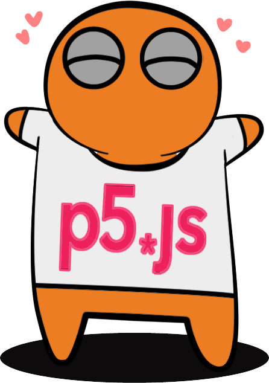

  

You're a miner and you got trapped in a cave. Find all crystals :gem: and beat your rivals' time! Watch out for mines!

## Game Link:

### Authors \- **"ACTAM Games.com"**
- [Zaccaria Eliseo Carrettoni](https://github.com/IronZack95)
- [Wendy Edda Wang](https://github.com/WendyWang29)
- [Alessandro Zullo](https://github.com/Alessandro199762)
- [Lorenzo Lellini](https://github.com/LorenzoLellini)  

<!--- --->
## Video Teaser:

## After cloning this repo (only the first time):
1. _open the terminal_
2. _go to the project path_
3. _run:_ **$ npm install**
4. _wait for the operation to finish_

## How to run this code:
1. _open the terminal_
2. _go to the project path_
3. _run:_ **$ npm run dev**  (FOR DEVELOPMENTS)
4. _run:_ **$ npm run start**  (FOR RELEASE)
5. _follow the instructions on the console for accessing the browser interface_
6. _to stop node js run_ CTRL+C : **$ ^C**

:warning: Tested and optimized for Chrome, Brave, Edge. DOES NOT WORK on Safari. :warning:

# Documentation:
1. [Introduction](#intro)
2. [Gameplay](#gameplay)
3. [One Page App](#onepageapp)
4. [Server](#server)
5. [Future Improvements](#future)
6. [Legal Notices](#legal)

# Introduction 
 **Advanced Coding Tools**  _and Metodologies_ \- **Final Project**  
Our main objective was to develop an audio based video game running on a self hosted environment,
emulating full stack development and deployment.

# Gameplay   
## P5.js library
**[p5.js](https://p5js.org/)** is a JavaScript library which allowed us, by creating a new p5 instance, to work on a _canvas_ element following the same procedures available in Processing, i.e. setting up the _setup_ and the _draw_ functions. The library also came in handy for images/sounds file handling, vectorial computations and sound file manipulations. For the sound effects in our game we exploited the [p5.Sound](https://p5js.org/reference/#/libraries/p5.sound) core library, which extends p5 with Web Audio funcionalities.   

## Game Loop
:small_blue_diamond: Our videogame runs on a loop. The loop is made possible thanks to the above mentioned _setup_ and _draw_ functions available with the p5 instance. The loop starts by presenting to the user a situation. The game should then receive the user inputs (in our case mouse movement and keys pressed), interpet these inputs (in our case as movements of the character) and calculate the new situation that results from this act. This involves computing if the player got a crystal, can hear a mine, hits a mine etc. At this point a new situation is proposed to the player and the loop runs again.

  

## Game Logic
:small_blue_diamond:  **Player** : The player figure can be moved in the canvas area with W A S D keys and includes animations during the motion. Legs are moving as it walks and eyes can rotate by 360° following the mouse.

:small_blue_diamond:  **Walls** : Walls are randomly generated with a perlin noise algorithm in each game and the player cannot move through them. The player body is considered as a circle and when its radius hits a wall perimeter and the wall detection function returns a true value, all the movements in the wall direction are forbidden.

:small_blue_diamond: **Mines and Crystals** : Mines and Crystals are created from the same array of objects, splitting them in 2 different sub arrays. If the player accidentally hits a mine, score will be decreases of 200 points, while, if he eats a crystal the score will be increased of 100 points. There is a special green crystal that scores 1000 points too. It has to be discovered by the player using the sound and it appears on the canvas only when the player is below a ceratin distance. The goal of the game is to collect all the crystals on the map avoiding the mines.

  

## Audio Logic

:small_blue_diamond:  **Panning and Gain** : Player cannot see the mines and the green crystal on the canvas and the only way to locate them is to listen and rotate the eyes using the mouse. Eyes rotation is, in fact, related to sound panning. If the angle between the vector that goes from the player's head to the mouse, and the vector that goes from the player to the mine position (if the mine is close enough) is between -100° and +100° panning can be appreciated.  

  

    

Moreover, the sound volume of these objects changes according with the player distance. Starting from a certain distance, the closer the player is to the mine, the higher the gain will be.

:small_blue_diamond:  **Pitching** : In order to easily locate the mines, in addiction to the panning and gain variation, also the mine sound pitch changes according with player distance. The closer the player is to the mine, the higher the pitch will be.

:small_blue_diamond:  **Wall Detection** : the green crystal object is invisible but can be found by the player if he gets close enough to it as glimmering sound will be heard. If between the crystal and the player there is a wall, the sound comes muffled, otherwise it comes bright and clear. To detect if there's a wall or not between the player and the crystal the game computes line intersections. If the line that goes from the head of the player to the center of the crystal intersects one of the 4 walls of a wall the sound comes muffled.

 

  

:small_blue_diamond:  **Sounds** : All the sounds are loaded at the beginning of the game and loopped according with their duration. Player will hear only mines and green crystal sounds below a certain distance in pixel. Walk sound and eat crystal sound are loaded at the beginning of the game too but they are played only if the related event happens.

## Utilities
:small_blue_diamond:  **Perlin Noise** :
Since we wanted a map that could be different every time the user begins a new game, we've implemented an algorithm capable of generating random noise.
In order to do so, a noise-generator, in particular a Perlin noise generator, function has been created;
The Perlin noise is a gradient noise, which means that the signal is derived from a random distribution of vectors in a grid and their subsequent interpolation.
The result is a random but smooth distribution of the signal.
Finally, the figure has been lowered in resolution in order to obtain a more pixelated effect.  

  

# One Page APP 
 This application is a single-page app.
This means that all of the necessary code is wether retrieved in a single page-load, or the appropriate resources are dynamically loaded and added to the page when needed (for instance when clicking on a button), and that The page never reloads, nor does it leave control in another page.

:small_blue_diamond:  **singleton**: The _singleton_ design pattern is a way of creating a single object that is shared among a bunch of other resources in the app. An app can have only one instantiation of this kind of object at a time.
In our project the "Schermo" object is a singleton. The class constructor verifies if an instance of the object already exists before creating a new one. "Schermo" is associated to an empty div meant to fill the whole window and it's shared by all of our "page type" classes (Lobby, SinglePlayer and Multiplayer game pages, GameOver pages...)

:small_blue_diamond:  **Cloud**: When a single-player game ends, the previous players list appears on screen, highlighting your score.
To do so, we store and retrieve players' data in a .json file called "data" through the node's functions "readFile" and "writeFile".
These functions are capable of reading and writing from/on .json files in an asynchronous way.
That a function is asynchronous means that, when it is called, the file reading process starts and the control shifts to next line executing the remaining lines of code.
Once the file data has been loaded, the function will call the callback function provided to it.
By using async functions we aren't blocking code execution while waiting for the operating system to get back with data.

:small_blue_diamond:  **Automatic Naming (API)**:
When you start a new game, whether in single or multi-player, you are prompted to enter a name; if this is not done the game randomly assigns name.
To implement this feature, we have created the "randomName()" function in "utility.js", which retrieves a random name from the following [API](https://random-names-api.herokuapp.com/random).

 

  
  
  

# Server 
info sul MultiPlayer                                
:small_blue_diamond:  **Node.js**: is a Javascript runtime using non-blocking I/O (it does not block itself on only one request at a time) and asynchronous (uses callbacks) programming. npm is used to manage
Node.js packages. In our project the following packages are included:  
:heavy_minus_sign: [Express](https://expressjs.com/it/) framework, to setup a server listening to a specific port;  
:heavy_minus_sign: [Nodemon](https://github.com/remy/nodemon) wrapper, that allowed us to automatically restart the server everytime a change was made in the code.    

:small_blue_diamond:  **Socket.io**: [WebSoket](https://socket.io/) is a communication protocol which provides a full-duplex and low-latency channel between the server and the browser.
This takes advantage of the existing TCP connection
created by HTTP protocol to establish a bidirectional channel. Socket.io is used in two different contexts in the project. In the multiplayer to swap all
information between the various clients connected to the same game room, to which a specific soket.id is assigned. In the Singleplayer to load updated data at the end of a
game and download the updated data from the database.

To emulate direct communication between two clients, the server is in the middle and routes the data traffic for each pair of players.
Mainly we used the following Socket.io communications:
1. Emission / listening of single events: in this case, each communication for which a specific protocol is required in the game dynamics is mapped by assigning him one
specific event. The client transmits data to the server or vice versa, in one direction only. Broadcast communications are possible on the server side, but never used.
2. Event Acknowledgment: Similar to the previous case, but whoever issued the event expects a return recall message. This type of message is used for
example in the management of the game Lobby and in the creation of games, as the client must know from the server if the game is ready or must wait for it to connect
another player.
3. Volatile messages: this type of messages are similar to the first type, but emulate a behavior similar to that which occurs on a UDP channel, ie they are
overwritten by more recent messages of the same type without having to wait for a low-level ACKN message such as TCP. This feature makes them a lot
performing in transmitting game data in real time position, the last position issued is the one desired.

:small_blue_diamond:  **Game State**: The Back-end uses four index.js files, game.js server.js utility.js. It all starts from the index.js file which first of all takes care of loading the other three
files as modules, specifically these deal with:

- server.js loads the settings of express.js and actually puts the server listening on port 3000.
- Game.js Contains all the classes and methods to create the GameState object and manage its operation. moreover, an arrey to store all the Game state objects, and an arrey to
store all the clients connected at the same time through their ID are created.
The Game State object is created at the connection of the first client in the Lobby-Multi and keeps track of every variable related to the game, from the positions of the
walls, to the
crystals, mines to the colors of the individual players. As many game state objects can be created as there are games in progress simultaneously.
- Utility contains the information to generate the server side game state perlin map.

after which Index.js only takes care of instantiating the server.io object inside which all the Socket functions are located.

:small_blue_diamond:  **Docker**: The deployment of this project was done in several phases that we will illustrate trying to solve the following critical issues:

1. Protected and isolated environment to run the application on the Server side
2. compatibility with modern browsers, ie use of an https protocol
3. permanent noSQL database

Now let's see what are the solutions adopted:

1. To meet all the needs of optimizations and compatibility,
the best solution was to use [Docker](https://www.docker.com/) container. Dockerization allows
programs to run bypassing the SO specific linux distribution and using
only the linux kernel, this allows a better isolation of the softwares
and a valid alternative to the virtual machine.

2. At present the application communicates via http protocol.
To convert an https request into an http response, a possible solution is to use a Reverse-Proxy placed between the client and the server. In this case the
reverse proxy adopted NGINX runs in an isolated docker container and is placed via a network bridge between the game container and the external network interface. Of
once the reverse-proxy is done, it listens on the same port as the game container and at each specific URL request it is activated by filtering all requests and creating a
additional security layer using Let's Encrypt SSL certificates.

3. Docker provides a mount-like method for preserving storage volumes within the host machine. In the docker-compose.yaml file, you can see how it has been remapped
the path to the app's noSQL database on a specific host path. In this way the memory volume related to that specific path is permanent.

   

 

  # Future improvements      
1. NoSQL to SQL DataBase into container
2. User Login
3. Customizable players' options
4. Flags for identified mine's positions
5. Volume sliders
6. Interactions between players
7. Customizable Matches
8. In-game purchases 
9. Player Skins

 # Legal Notices 
:warning: This project is not intended for redistribution or commercial use by anyone except the authors. :warning:
 

